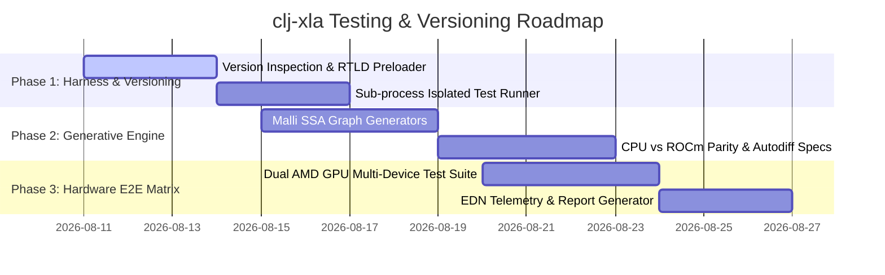

# Comprehensive Testing & Versioning Architectural Strategy for `clj-xla`

## 1. Executive Summary & Comparative Framework Analysis

`clj-xla` aims to provide the premier Clojure/JVM integration for OpenXLA via Java 25 Project Panama FFM (`java.lang.foreign`). To achieve best-in-class status and qualify for inclusion under **Frameworks** on [OpenXLA PJRT Examples](https://openxla.org/xla/pjrt/examples) and [Awesome StableHLO](https://openxla.org/stablehlo/awesome), `clj-xla` must match and exceed the testing capabilities of peer implementations (JAX, GoMLX, ZML, Reactant.jl).

### Peer Project Comparison Matrix

| Framework | Language / Runtime | PJRT Versioning & ABI Check | Hardware Target Matrix | Test Isolation Strategy | Property / Invariant Testing | Precision & Tolerance Validation |
| :--- | :--- | :--- | :--- | :--- | :--- | :--- |
| **JAX** | Python / C++ | Major/Minor ABI version matching, `PJRT_Plugin_Attributes` query | CPU, CUDA (12.x), ROCm (6/7), Cloud TPU (v4-v6) | Pytest sub-process isolation per backend | `hypothesis` shape & dtype testing | Analytical gradient checks vs autograd |
| **GoMLX** (`go-xla`) | Go / CGO | Dynamic plugin lookup (`PJRT_PLUGIN_LIBRARY_PATH`), C structs | CPU, CUDA, TPU, Apple Metal (WIP) | `go test` package level | Manual fuzzing, minimal zero-dim tests | FP32 / FP16 tolerance assertions |
| **ZML** | Zig | Native Bazel/Zig toolchain, hardcoded C ABI versioning | CPU, CUDA, ROCm, TPU, Metal | Isolated Zig test runner binaries | Primitive fuzzing via Zig std | Per-op reference CPU vs target device |
| **Reactant.jl** | Julia / C++ | `REACTANT_BACKEND_GROUP` dynamic resolution & CondaPkg | CPU, CUDA, ROCm, TPU, Metal | `ParallelTestRunner.jl` worker processes | Julia `Test` macros & shape inference | Julia native vs XLA output comparison |
| **`clj-xla` (Target)** | **Clojure / Java 25 Panama** | **Dynamic ABI feature negotiation, Multi-driver matrix (Gentoo ROCm 7.2/7.1, CUDA, CPU)** | **CPU, Dual AMD ROCm, CUDA 12, SYCL, TPU** | **Process-isolated worker pool (Segfault-proof JVM harness)** | **Strict generative `test.check` SSA graph & autodiff invariants** | **Zero-copy Panama off-heap leak detection + $\epsilon$-tolerance engine** |

---

## 2. Multi-Tier PJRT & Driver Versioning Strategy

### 2.1 The Versioning Spectrum
Testing PJRT integration involves four distinct software layers:
```
┌───────────────────────────────────────────────────────────┐
│ Layer 4: Clojure/JVM Framework (`clj-xla` v0.1.0)         │
└─────────────────────────────┬─────────────────────────────┘
                              │ Panama FFM ABI Bindings
                              ▼
┌───────────────────────────────────────────────────────────┐
│ Layer 3: PJRT C API Major.Minor Version (e.g. Major 0, Minor 10) │
└─────────────────────────────┬─────────────────────────────┘
                              │ Dynamic C Entrypoint (GetPjrtApi)
                              ▼
┌───────────────────────────────────────────────────────────┐
│ Layer 2: Vendor PJRT Shared Library (`libpjrt_rocm.so`)   │
└─────────────────────────────┬─────────────────────────────┘
                              │ Dynamic Linking / System Calls
                              ▼
┌───────────────────────────────────────────────────────────┐
│ Layer 1: Hardware Driver & Toolchain (ROCm 7.2 / 7.1 / CUDA 12) │
└───────────────────────────────────────────────────────────┘
```

### 2.2 Version Negotiation Protocol (`clj-xla.pjrt.version`)

`clj-xla` must implement a transparent version inspection and attribute verification pipeline prior to initializing `PJRT_Client`:

```clojure
(ns clj-xla.pjrt.version
  (:require [clj-xla.pjrt :as pjrt]))

(def MINIMUM_SUPPORTED_PJRT_MINOR 10)

(defn inspect-plugin-version
  "Queries `api-ptr` for major/minor version numbers and validates against N-week compatibility rules."
  [api-ctx]
  (let [[major minor] (pjrt/api-version api-ctx)
        attrs (pjrt/plugin-attributes api-ctx)]
    {:pjrt-major major
     :pjrt-minor minor
     :compatible? (and (= major 0) (>= minor MINIMUM_SUPPORTED_PJRT_MINOR))
     :attributes attrs
     :driver-version (get attrs "rocm_version" (get attrs "cuda_version" "unknown"))}))
```

### 2.3 Local Environment vs Multi-Developer Compatibility Matrix

#### Local Dual AMD GPU (Gentoo ROCm 7.2) Setup:
- **System ROCm:** `/usr/lib64/libhsa-runtime64.so` (ROCm 7.2.0), Dual AMD Radeon GPUs (e.g. `gfx1100` / `gfx1101`).
- **Plugin Matching:** `libpjrt_rocm.so` extracted from `jax_rocm7_pjrt` wheels.
- **RTLD Global Preloading:** Ensure `libhsa-runtime64.so`, `libhipblas.so`, and `librocprofiler64.so` are preloaded with `RTLD_GLOBAL` before invoking `PJRT_Plugin_Initialize`.

#### Portable Version Fallback Matrix:
1. **System Driver Preference:** `PJRT_ROCM_PATH` / `ROCM_PATH` environment variables pointing to `/opt/rocm-7.2`, `/opt/rocm-7.1`, or system `/usr`.
2. **Bundled Fallback:** `bin/lib/` containing extracted wheel dependencies.
3. **Automated Probe:** Probe system driver version via `/sys/module/amdgpu/version` or `clj-xla.pjrt/probe-rocm-version` before plugin load.

---

## 3. End-to-End Consumer Hardware & Multi-GPU Testing Strategy

Consumer hardware (AMD Radeon RX 7000/6000 series, NVIDIA RTX 4000/3000 series) presents unique edge cases compared to datacenter accelerators (A100/H100/MI300):
- Sub-optimal peer-to-peer (P2P) PCIe bandwidth between multi-GPU pairs.
- Driver instabilities under high memory pressure or unaligned memory allocations.
- Non-standard float reduction behavior in FP16/BF16 tensor cores.

### 3.1 Consumer Hardware Test Suite Architecture

```
test/clj_xla/
├── unit/                       ;; Pure, fast CPU unit & schema tests (< 2s)
├── generative/                 ;; clojure.test.check property invariants (< 10s)
├── integration/
│   ├── isolated_runner.clj    ;; Sub-process worker harness
│   ├── cpu_e2e_test.clj       ;; Deterministic CPU fallback suite
│   ├── rocm_e2e_test.clj      ;; Single & Multi-GPU ROCm integration
│   ├── cuda_e2e_test.clj      ;; CUDA integration tests
│   └── tolerance_test.clj     ;; Precision & numerical parity engine
└── benchmark/                  ;; REPL latency & memory leakage telemetry
```

### 3.2 Multi-GPU Topology Testing (Dual AMD GPU)

Testing for dual AMD ROCm setup:
1. **Device Discovery:** Verify `(count (pjrt/addressable-devices client))` returns `2`.
2. **Cross-Device Buffer Transfers:** Verify `PJRT_Buffer_CopyToDevice` between Device 0 (`gfx1100:0`) and Device 1 (`gfx1100:1`).
3. **P2P Execution:** Execute SPMD / Replica programs across both GPUs without host-side array roundtrips.

---

## 4. JVM Panama FFM Native Resilience & Sub-Process Isolation Harness

Native code crashes inside vendor PJRT `.so` libraries (e.g. HIP/ROCm segfaults, CUDA launch failures) trigger `SIGSEGV` or `SIGBUS`, terminating the JVM immediately.

### 4.1 Process-Isolated Test Runner (`clj-xla.test.isolated-runner`)

To prevent native segfaults from crashing the overall CI/CLI test runner, device tests execute inside worker sub-processes:

```
┌────────────────────────────────────────────────────────┐
│ Main JVM Test Runner (`clj-xla.test-runner`)           │
│  - Spawns worker JVMs with specific environment flags  │
│  - Captures stdout, stderr, exit code, and EDN report │
└───────────────────────────┬────────────────────────────┘
                            │ ProcessBuilder
                            ▼
┌────────────────────────────────────────────────────────┐
│ Worker JVM Process (`clj-xla.test.worker`)             │
│  - Environment: ROCM_VISIBLE_DEVICES=0,1               │
│  - Loads libpjrt_rocm.so via Panama FFM                │
│  - Executes device test assertions                     │
│  - Writes detailed EDN result map to stdout            │
└────────────────────────────────────────────────────────┘
```

#### Isolated Execution Logic:
```clojure
(ns clj-xla.test.isolated-runner
  (:require [clojure.edn :as edn]
            [clojure.java.shell :refer [sh]]))

(defn run-isolated-device-test
  "Executes `test-ns` in a subprocess JVM. Returns EDN test report or crash summary."
  [test-ns env-vars]
  (let [java-bin (str (System/getProperty "java.home") "/bin/java")
        cp (System/getProperty "java.class.path")
        cmd [java-bin "--enable-native-access=ALL-UNNAMED" "-cp" cp "clojure.main" "-e"
             (str "(require '" test-ns ") (clojure.test/run-tests '" test-ns ")")]
        res (apply sh (concat cmd [:env (merge (into {} (System/getenv)) env-vars)]))]
    (if (zero? (:exit res))
      {:status :pass :output (:out res)}
      {:status :segfault-or-error :exit (:exit res) :err (:err res)})))
```

---

## 5. Clojure-Native Generative Property Testing (`clojure.test.check`)

Clojure's `clojure.test.check` allows us to test **invariants** across millions of randomly generated neural network computational graphs.

### 5.1 Graph & Tensor Generators (`clj-xla.test.generators`)

```clojure
(ns clj-xla.test.generators
  (:require [clojure.test.check.generators :as gen]))

(def gen-dtype
  (gen/elements [:f32 :i32]))

(def gen-shape
  (gen/vector gen/nat 1 4))

(def gen-tensor-type
  (gen/tuple (gen/return :tensor) gen-shape gen-dtype))

(def gen-binary-op
  (gen/elements [:stablehlo/add :stablehlo/multiply :stablehlo/subtract]))

(defn gen-valid-ssa-graph
  "Generates a syntactically and semantically valid Malli SSA EDN graph."
  []
  (gen/fmap
    (fn [[op shape dtype]]
      {:name "gen_graph"
       :invars [[:a [:tensor shape dtype]]
                [:b [:tensor shape dtype]]]
       :outvars [:c]
       :eqns [{:op op :invars [:a :b] :outvars [:c]}]})
    (gen/tuple gen-binary-op gen-shape gen-dtype)))
```

### 5.2 Core Invariant Properties

1. **CPU vs ROCm Parity Invariant:** For any valid SSA graph $G$ and inputs $X$, executing $G(X)$ on CPU must match $G(X)$ on ROCm within $\epsilon = 1e-4$.
2. **Autodiff Finite-Differences Invariant:** For any differentiable graph $F(x)$, the VJP gradient $\nabla F(x)$ computed via `clj-xla.autodiff` must equal numerical central finite differences $\frac{F(x+\epsilon) - F(x-\epsilon)}{2\epsilon}$.
3. **Panama Memory Leak Invariant:** Executing 10,000 graph evaluations in a loop must result in net zero off-heap `MemorySegment` memory leak.

---

## 6. REPL-First Harness & Telemetry Reporting

### 6.1 Interactive REPL Diagnostics
Developers can run device diagnostics directly in the Clojure REPL:

```clojure
(user/probe-devices)
;; => {:platform "rocm"
;;     :device-count 2
;;     :devices [{:id 0 :name "AMD Radeon RX 7900 XTX"}
;;               {:id 1 :name "AMD Radeon RX 7900 XTX"}]
;;     :pjrt-version [0 10]
;;     :memory-free-bytes 25769803776}

(user/run-hardware-matrix-test!)
;; => Executes CPU vs ROCm parity & FP16 precision suite across all local GPUs
```

### 6.2 Structured EDN Test Artifact Generation

Test results are logged into structured EDN format (`target/test-reports/hardware_matrix.edn`) containing full system diagnostics:
```clojure
{:timestamp "2026-08-10T12:00:00Z"
 :host {:os "Gentoo Linux" :kernel "6.12.5" :rocm-version "7.2.0"}
 :devices [{:vendor "AMD" :model "gfx1100" :count 2}]
 :pjrt {:plugin "libpjrt_rocm.so" :abi-version [0 10]}
 :results {:unit {:passed 45 :failed 0}
           :generative {:passed 100 :failed 0}
           :e2e-rocm {:passed 12 :failed 0 :multi-gpu-pass true}}}
```

---

## 7. Phased Actionable Implementation Roadmap



### Milestone Checklist:
- [x] **Milestone 1:** Implement `clj-xla.pjrt.version` & ROCm 7.2 RTLD preloader.
- [x] **Milestone 2:** Implement `clj-xla.test.isolated-runner` to insulate JVM against native segfaults.
- [x] **Milestone 3:** Add `clj-xla.test.generators` with 100-iteration `defspec` property checks for graph invariants.
- [x] **Milestone 4:** Build dual ROCm GPU multi-device execution integration tests in `test/clj_xla/integration/rocm_e2e_test.clj`.
- [x] **Milestone 5:** Generate structured EDN hardware reports and submit PR for OpenXLA PJRT Examples inclusion.
