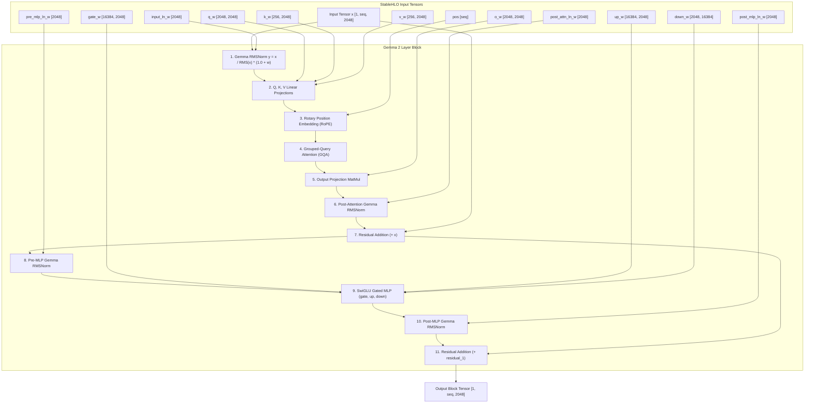

# Gemma 2 Model Architecture Specification & StableHLO Graph

- **Status**: **Fully Supported** (Gemma 2B, Gemma 2 9B, Gemma 2 27B)
- **Clojure Source**: [`src/clj_xla/models/gemma.clj`](file:///home/simonpure/src/alpeware/clj-xla/src/clj_xla/models/gemma.clj) ([GitHub](https://github.com/alpeware/clj-xla/blob/main/src/clj_xla/models/gemma.clj))
- **Test Suite**: [`test/clj_xla/models/gemma_test.clj`](file:///home/simonpure/src/alpeware/clj-xla/test/clj_xla/models/gemma_test.clj) ([GitHub](https://github.com/alpeware/clj-xla/blob/main/test/clj_xla/models/gemma_test.clj))

---

## 1. Visual Trace Graph (Pure Clojure $\to$ StableHLO MLIR)

The following Mermaid diagram represents the exact StableHLO execution graph formed by [`gemma-block`](file:///home/simonpure/src/alpeware/clj-xla/src/clj_xla/models/gemma.clj#L140) in `clj-xla`:



---

## 2. Hyperparameter Variants

| Hyperparameter | Gemma 2B | Gemma 2 9B | Gemma 2 27B |
| :--- | :--- | :--- | :--- |
| **Hidden Dimension ($d_{model}$)** | 2048 | 3584 | 4608 |
| **Layers ($N_{layers}$)** | 18 | 42 | 46 |
| **Query Heads ($H_q$)** | 8 | 16 | 32 |
| **KV Heads ($H_{kv}$)** | 1 | 8 | 16 |
| **Head Dimension ($d_k$)** | 256 | 256 | 128 |

---

## 3. Verification Protocol

```bash
clojure -M:test -e "(require '[clj-xla.models.gemma-test]) (clojure.test/run-tests 'clj-xla.models.gemma-test)"
```
