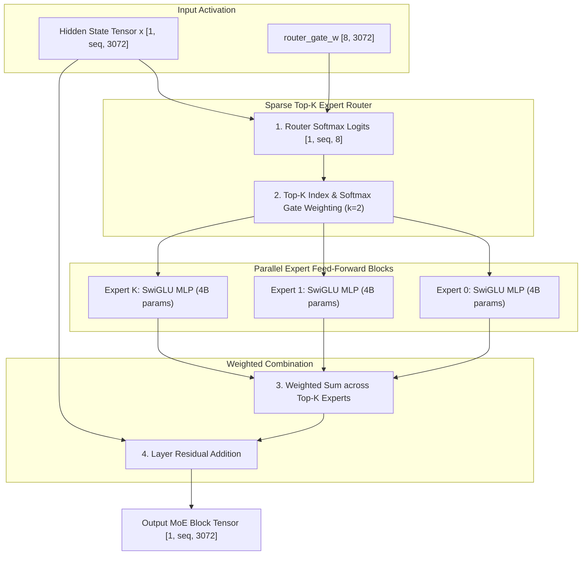

# Gemma 4 26B-A4B Mixture-of-Experts (MoE) Architecture Specification

- **Status**: **Planned / Backlog**
- **Target Namespace**: `clj-xla.models.gemma4-moe`
- **Target Hardware**: Laptops / Workstations (Intel Arc / Apple M4 36GB+ RAM)

---

## 1. Visual MoE Routing & Expert Dispatch Graph

The following Mermaid diagram represents the planned StableHLO trace graph for Gemma 4 26B-A4B's Sparse MoE layer:

---

## 2. Hyperparameter Specifications

| Hyperparameter | Gemma 4 26B-A4B |
| :--- | :--- |
| **Total Parameters** | 25.8 Billion |
| **Active Parameters per Token** | 3.9 Billion |
| **Total Experts** | 8 Experts |
| **Active Experts ($k$)** | 2 Experts per Token |
| **Hidden Dimension ($d_{model}$)** | 3072 |
| **Layers ($N_{layers}$)** | 48 |
