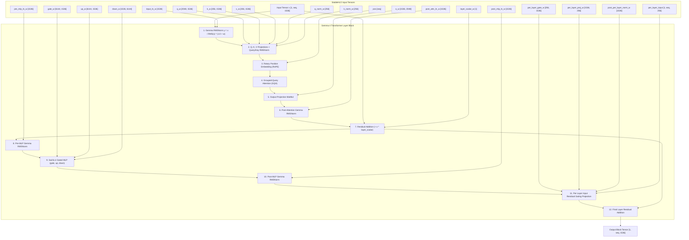

# Gemma 4 (E2B / E4B) Model Architecture Specification & StableHLO Graph

- **Status**: **Fully Supported** (Gemma 4 E2B, Gemma 4 E4B)
- **Clojure Source**: [`src/clj_xla/models/gemma.clj`](file:///home/simonpure/src/alpeware/clj-xla/src/clj_xla/models/gemma.clj) ([GitHub](https://github.com/alpeware/clj-xla/blob/main/src/clj_xla/models/gemma.clj))
- **CLI Hardware Runner**: [`scripts/gemma4_inference.clj`](file:///home/simonpure/src/alpeware/clj-xla/scripts/gemma4_inference.clj) ([GitHub](https://github.com/alpeware/clj-xla/blob/main/scripts/gemma4_inference.clj))
- **Test Suite**: [`test/clj_xla/models/gemma_test.clj`](file:///home/simonpure/src/alpeware/clj-xla/test/clj_xla/models/gemma_test.clj) ([GitHub](https://github.com/alpeware/clj-xla/blob/main/test/clj_xla/models/gemma_test.clj))

---

## 1. Visual Trace Graph (Pure Clojure $\to$ StableHLO MLIR)

The following Mermaid diagram represents the exact StableHLO execution graph formed by [`gemma4-block`](file:///home/simonpure/src/alpeware/clj-xla/src/clj_xla/models/gemma.clj#L210) in `clj-xla`:



---

## 2. Hyperparameter Variants

| Hyperparameter | Gemma 4 E2B | Gemma 4 E4B |
| :--- | :--- | :--- |
| **Hidden Dimension ($d_{model}$)** | 1536 | 2560 |
| **Layers ($N_{layers}$)** | 22 | 34 |
| **Query Heads ($H_q$)** | 8 | 10 |
| **KV Heads ($H_{kv}$)** | 1 | 2 |
| **Head Dimension ($d_k$)** | 256 | 256 |
| **Per-Layer Gating Dim** | 256 | 256 |

---

## 3. Interactive CLI Generation Command

Run single-batch hardware text generation on Intel Arc GPU (SYCL Level-Zero):
```bash
clojure -M scripts/gemma4_inference.clj --model Gemma-4-E2B-it --backend sycl --precision int8
```
