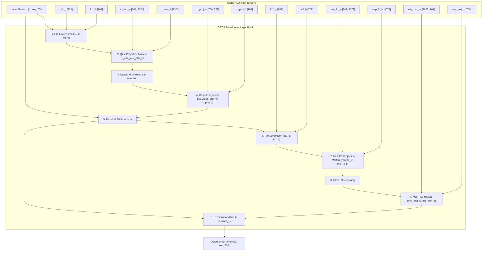

# GPT-2 Model Architecture Specification & StableHLO Graph

- **Status**: **Fully Supported**
- **Clojure Source**: [`src/clj_xla/models/gpt2.clj`](../../src/clj_xla/models/gpt2.clj)
- **Test Suite**: [`test/clj_xla/models/gpt2_test.clj`](../../test/clj_xla/models/gpt2_test.clj)

---

## 1. Visual Trace Graph (Pure Clojure $\to$ StableHLO MLIR)

The following Mermaid diagram represents the exact StableHLO execution graph formed by [`gpt2-block`](../../src/clj_xla/models/gpt2.clj#L10) in `clj-xla`:



---

## 2. Hyperparameter Variants

| Hyperparameter | GPT-2 Small | GPT-2 Medium | GPT-2 Large | GPT-2 XL |
| :--- | :--- | :--- | :--- | :--- |
| **Parameters** | 124M | 355M | 774M | 1.5B |
| **Hidden Dimension ($d_{model}$)** | 768 | 1024 | 1280 | 1600 |
| **Layers ($N_{layers}$)** | 12 | 24 | 36 | 48 |
| **Attention Heads ($H$)** | 12 | 16 | 20 | 25 |
| **Vocabulary Size ($V$)** | 50,257 | 50,257 | 50,257 | 50,257 |

---

## 3. Verification & Benchmark Protocol

* **Generative & Property Test Suite**:
  ```bash
  clojure -M:test -e "(require '[clj-xla.models.gpt2-test]) (clojure.test/run-tests 'clj-xla.models.gpt2-test)"
  ```
* **Benchmark Execution**: Measured in [`scripts/benchmark.clj`](../../scripts/benchmark.clj) as `gpt2-block`.
