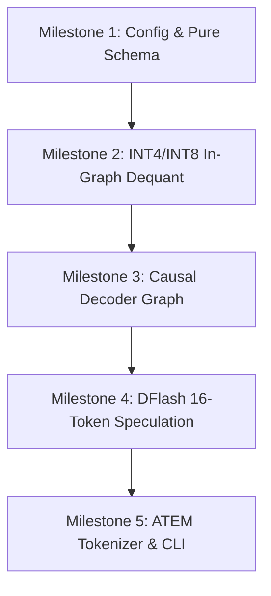

# Meta Muse-Glimmer-30B Architecture Specification & Implementation Plan

- **Status**: **Planned / Backlog**
- **Target Namespace**: `clj-xla.models.muse-glimmer`
- **License**: Apache 2.0 Open Weights
- **Target Hardware**: Consumer iGPUs / Laptops (Intel Arc 140V, Apple M4/M4 Pro, NVIDIA RTX 24GB/32GB)

---

## 1. Architectural Overview

Meta Muse-Glimmer-30B is an open-weight multimodal agentic model designed for local execution:
* **Perception Vision Encoder**: ~1.8B ViT-G/14 multimodal patch encoder.
* **Causal Language Decoder**: ~29.6B parameter decoder ($d_{model} = 6144$, 48 layers, 48 Query heads, 8 KV heads).
* **DFlash Block Speculative Predictor**: 16-token parallel block predictor.
* **ATEM Tool Execution Markup**: Machine-efficient XML-like tool call parser (`<atem:invoke>`).

---

## 2. Implementation Milestones & Verification Strategy

### Milestone 1: Model Configuration & Schema Definitions
- **Deliverable**: Define `clj-xla.models.muse-glimmer` config map and generative property tests in `test/clj_xla/models/muse_glimmer_test.clj`.
- **Verification**: `clojure -M:test -e "(require 'clj-xla.models.muse-glimmer-test)"` passes cleanly.

### Milestone 2: In-Graph INT4 / INT8 Weight De-quantization
- **Deliverable**: Implement fused de-quantization helper functions in `clj-xla.nn.quantization`.
- **Verification**: Verify parity between INT8 quantized weights and FP32 reference matmul outputs.

### Milestone 3: Causal Language Decoder Trace Graph
- **Deliverable**: Build pure Clojure graph tracer for Muse-Glimmer 30B backbone ($d_{model}=6144$, GQA, RoPE, SwiGLU).
- **Verification**: Test single-layer forward graph tracing and MLIR serialization.

### Milestone 4: DFlash 16-Token Parallel Block Speculation
- **Deliverable**: Implement DFlash block predictor graph $[1, 1, \text{dim}] \to [1, 16, V]$ and 16-token batched verification pass.
- **Verification**: Run parallel block verification test and measure acceptance rates.

### Milestone 5: ATEM Tokenizer & Interactive CLI Script
- **Deliverable**: Add `src/clj_xla/tokenizer/atem.clj` XML tool call parser and create `scripts/muse_glimmer_inference.clj`.
- **Verification**: Run local single-batch agentic prompt execution on Intel Arc SYCL / CPU.
