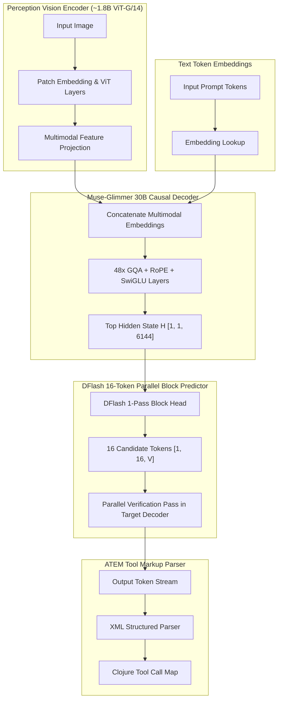

# Meta Muse-Glimmer-30B Architecture Specification & Implementation Plan

- **Status**: **Planned / Backlog**
- **Target Namespace**: `clj-xla.models.muse-glimmer`
- **License**: Apache 2.0 Open Weights
- **Target Hardware**: Consumer iGPUs / Laptops (Intel Arc 140V, Apple M4/M4 Pro, NVIDIA RTX 24GB/32GB)

---

## 1. Visual Architecture Graph (Vision + 30B Decoder + DFlash Speculation)

---

## 2. Model Specifications

| Attribute | Specification |
| :--- | :--- |
| **Causal Decoder Parameters** | ~29.6 Billion ($d_{model} = 6144$, 48 layers, 48 Query heads, 8 KV heads) |
| **Vision Encoder Parameters** | ~1.8 Billion (ViT-G/14 multimodal patch encoder) |
| **Speculative Predictor** | DFlash 16-token parallel block predictor |
| **Tool Calling Representation** | ATEM XML markup (`<atem:invoke name="...">`) |
| **License** | Apache 2.0 |

---

## 3. Milestone Implementation Plan

1. **Milestone 1**: `clj-xla.models.muse-glimmer` config schema and property tests.
2. **Milestone 2**: In-graph INT4 / INT8 de-quantization in `clj-xla.nn.quantization`.
3. **Milestone 3**: 30B Causal Transformer backbone trace graph.
4. **Milestone 4**: DFlash 16-token parallel block predictor graph & batched verification pass.
5. **Milestone 5**: ATEM XML tool markup parser (`clj-xla.tokenizer.atem`) & CLI script `scripts/muse_glimmer_inference.clj`.
