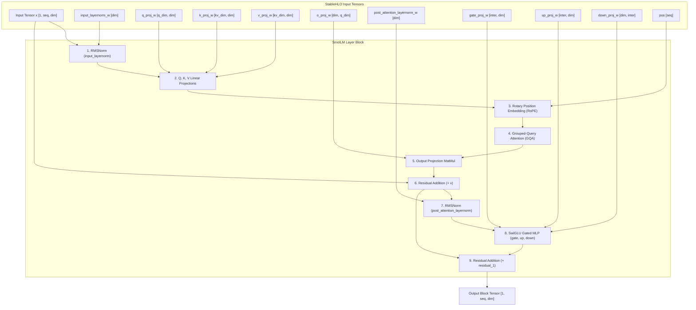

# SmolLM Architecture Specification & StableHLO Graph

- **Status**: **Fully Supported** (SmolLM-135M, SmolLM-360M, SmolLM-1.7B)
- **Clojure Source**: [`src/clj_xla/models/smollm.clj`](../../src/clj_xla/models/smollm.clj)

---

## 1. Visual Trace Graph (Pure Clojure $\to$ StableHLO MLIR)

The following Mermaid diagram represents the exact StableHLO execution graph formed by [`smollm-block`](../../src/clj_xla/models/smollm.clj#L15) in `clj-xla`:



---

## 2. Hyperparameter Variants

| Hyperparameter | SmolLM-135M | SmolLM-360M | SmolLM-1.7B |
| :--- | :--- | :--- | :--- |
| **Hidden Dimension ($d_{model}$)** | 576 | 960 | 2048 |
| **Layers ($N_{layers}$)** | 30 | 32 | 24 |
| **Query Heads ($H_q$)** | 9 | 15 | 32 |
| **KV Heads ($H_{kv}$)** | 3 | 5 | 32 |
| **Head Dimension ($d_k$)** | 64 | 64 | 64 |
| **Intermediate MLP Dim** | 1536 | 2560 | 5632 |

---

## 3. Verification Protocol

```bash
clojure -M:test -e "(require '[clj-xla.models.smollm])"
```
