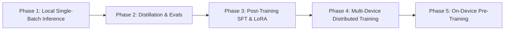

# Full-Stack On-Device AI Roadmap: From Inference to Pre-Training

The long-term vision of `clj-xla` is to provide a unified, pure Clojure numerical infrastructure powered by OpenXLA that spans the **entire Machine Learning lifecycle** on consumer hardware (laptops, desktops, workstations with Intel SYCL, AMD ROCm, NVIDIA CUDA, Apple Metal).

---

## 🗺️ The 5-Phase Full-Stack Roadmap

---

### Phase 1: Local Single-Batch Inference (Current Focus)
* **Goal**: Minimize single-request ($B=1$) latency on consumer hardware via zero-copy unified memory, in-graph quantization, and speculative decoding.
* **Key Components**:
  - StableHLO graph tracing (`clj-xla.trace`).
  - Native Panama PJRT C API bindings (`clj-xla.pjrt`).
  - SOTA benchmark suite (`scripts/benchmark.clj`).
  - Gemma 4, GPT-2, SmolLM, and Muse-Glimmer model definitions.

---

### Phase 2: Distillation & Automated Evaluation Framework
* **Goal**: Build pure Clojure evaluation suites and model distillation utilities for consumer devices.
* **Key Additions**:
  - Task evaluation harness (MMLU, GSM8K, HumanEval, SWE-bench mini).
  - Logit distillation loss pipeline (`clj-xla.nn.loss`) to train small draft assistant models (e.g. 15MB EAGLE heads or 300M draft models).

---

### Phase 3: Post-Training (SFT, LoRA, DPO)
* **Goal**: Enable fine-tuning of 8B – 30B parameter models on single consumer GPUs (24GB – 32GB RAM).
* **Key Additions**:
  - Reverse-mode Automatic Differentiation (VJP / Reverse AD in `clj-xla.autodiff`).
  - Low-Rank Adaptation (LoRA) linear layers ($A \times B$ adapters).
  - AdamW optimizer in StableHLO MLIR (`clj-xla.opt`).

---

### Phase 4: Multi-Device Distributed Parallelism
* **Goal**: Scale training and inference across local multi-GPU desktops and heterogeneous laptop clusters.
* **Key Additions**:
  - OpenXLA `ReplicaGroup` and collective communication (`AllReduce`, `AllGather`, `ReduceScatter`).
  - Tensor Parallelism (TP) and Pipeline Parallelism (PP).

---

### Phase 5: On-Device Pre-Training Infrastructure
* **Goal**: Pre-train specialized small-to-medium models (100M – 3B) from scratch on consumer hardware using pure OpenXLA pipeline compilation.
