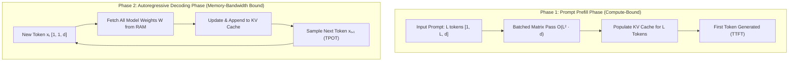

# Inference Dynamics: Prompt Prefill Phase vs. Autoregressive Decoding Phase ($B=1$)

LLM inference consists of two computationally distinct execution phases: the **Compute-Bound Prompt Prefill Phase** and the **Memory-Bandwidth Bound Autoregressive Decoding Phase**.

---

## 1. Comparative Dynamics

---

## 2. Mathematical Breakdown

| Execution Attribute | Phase 1: Prompt Prefill Phase | Phase 2: Autoregressive Decoding ($B=1$) |
| :--- | :--- | :--- |
| **Input Shape** | $[1, L, d]$ (Prompt of length $L$) | $[1, 1, d]$ (Single token step) |
| **Primary Metric** | **Time to First Token (TTFT)** | **Time Per Output Token (TPOT)** |
| **Compute Complexity** | $O(L^2 \cdot d)$ (Quadratic in prompt length) | $O(d)$ (Linear in model dimension) |
| **Arithmetic Intensity** | High ($\gg 50 \text{ FLOPs/byte}$) | Extremely Low ($\approx 1 - 2 \text{ FLOPs/byte}$) |
| **Hardware Bottleneck** | **Compute-Bound** (GPU Tensor Cores) | **Memory-Bandwidth Bound** (RAM/iGPU Bus) |
| **GPU Tensor Core Utilization** | $70\% - 90\%$ | $< 5\%$ (Waiting for weight bytes) |

---

## 3. Clojure Implementation in `clj-xla`

- **Prefill Execution**: Handled in [`clj-xla.generation/autoregressive-cached-step`](file:///home/simonpure/src/alpeware/clj-xla/src/clj_xla/generation.clj#L20) ([GitHub](https://github.com/alpeware/clj-xla/blob/main/src/clj_xla/generation.clj#L20)) where prompt sequence tokens are evaluated in a single matrix pass.
- **Decoding Loop**: Executed iteratively in [`clj-xla.generation/autoregressive-cached-step`](file:///home/simonpure/src/alpeware/clj-xla/src/clj_xla/generation.clj#L45) ([GitHub](https://github.com/alpeware/clj-xla/blob/main/src/clj_xla/generation.clj#L45)) passing length-1 tokens alongside updated KV-cache handles.
