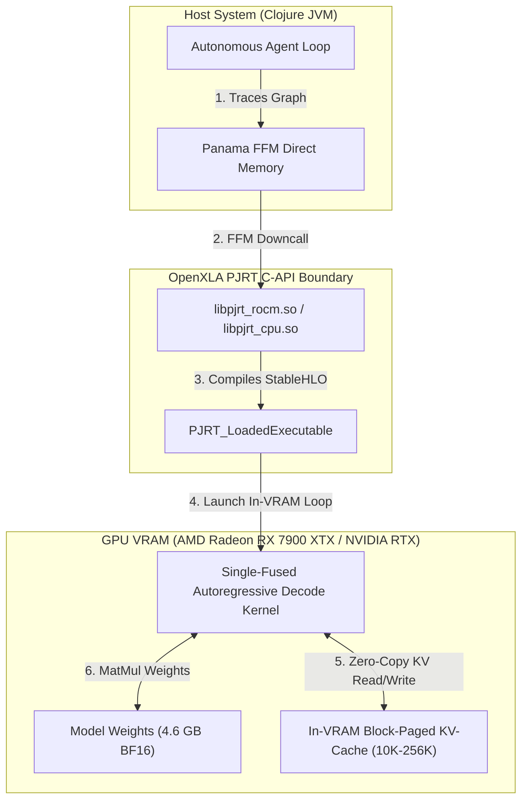

# OpenXLA PJRT Hardware Constraints & In-VRAM Agent Execution Knowledge Base

Welcome to the **OpenXLA & PJRT Architectural Knowledge Base**. 

This documentation hub details the empirical limitations, compiler lowerings, hardware alignment requirements, and state-of-the-art (SOTA) memory algorithms for executing long-running autonomous AI agent loops inside GPU VRAM via **OpenXLA** and **Clojure `clj-xla`**.

---

## 💡 Architecture & Design Goals for Autonomous Agents

Autonomous software agents require fast, low-latency, and continuous autoregressive token generation across extended context windows ($10\text{K}$ to $256\text{K}$ tokens). To maximize throughput and eliminate host-side CPU bottlenecks, `clj-xla` focuses on:

1. **Zero Host-GPU Roundtripping**: Keeping model weights, KV-caches, and token state strictly in GPU VRAM across decode iterations.
2. **Pure OpenXLA Execution**: Fusing prefill and decode graph executions via StableHLO MLIR without custom host-side Java primitive loops.
3. **Hardware-Aligned Memory Management**: Leveraging Panama Foreign Function & Memory (FFM) with 128-byte hardware alignment to avoid unmapped memory accesses during AMD RDNA3 / NVIDIA Tensor Core vector reads.

---

## 📚 Knowledge Base Index

### 1. ⚙️ [OpenXLA & PJRT Hardware & Compiler Limitations](pjrt_limitations.md)
- **Native FFM Downcall Semantics**: Struct layout alignment for `PJRT_ExecuteOptions`, `events-ptrs` handling, and double-free avoidance.
- **ROCm & CUDA LLVM Lowering Limits**: The 32-bit offset boundary in un-chunked `stablehlo.dynamic_update_slice` when sequence length $S > 2048$.
- **Signal Chaining**: Interposing JVM signal handlers with ROCm LLVM using `LD_PRELOAD=libjsig.so`.
- **Memory Alignment & Temp Pools**: 128-byte off-heap segment alignment and OpenXLA scratch pool limits.

### 2. 🔁 [In-VRAM Autonomous Agent Execution Loop](agent_vram_loop.md)
- **Strategy Analysis**: Roundtrip CPU-GPU execution vs. In-VRAM Single-Fused Kernel (`stablehlo.while`).
- **State Tuple Representation**: Encapsulating model tokens, sequence indices, logits, and 70 KV-cache layer tensors in a single immutable StableHLO loop state.
- **In-Graph Dynamic Token Selection**: Fusing Top-K / Top-P temperature sampling directly into the XLA execution graph.
- **Zero-Copy Host Buffer Transfers**: Pre-allocated device buffers and Panama FFM Arena lifetime management.

### 3. 🧩 [Paged KV-Cache & Long-Context VRAM Allocation](paged_attention_vram.md)
- **VRAM Memory Math**: Precise memory breakdown for model weights, KV-cache, and attention scratch activations up to 256K context windows.
- **PagedAttention in StableHLO**: Fixed 1024-token page tables and indirect block lookup matrices.
- **Chunked Sequence Updates**: Preventing 32-bit indexing overflows via block-padded slice mutations.
- **In-Graph Quantized KV Cache**: FP8 and INT8 KV-cache quantization for 4x VRAM memory reduction.

---

## 🏛️ System Architecture Overview

