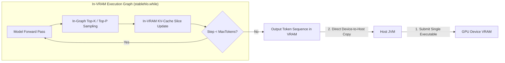

# In-VRAM Autonomous Agent Execution Loop

This document outlines the architectural design and algorithms required to execute **100% In-VRAM Autonomous Agent Loops** in Clojure `clj-xla` using **OpenXLA** and **StableHLO MLIR**.

---

## 1. 🎯 Architectural Goals: Zero-Host Roundtripping

Traditional LLM inference runtimes alternate between GPU forward pass launches and CPU-side token decoding loops:

```
[GPU Forward Pass] ──(Host Transfer)──> [CPU Token Extract & Top-K] ──(Host Transfer)──> [GPU Forward Pass]
```

For long-running software agents (e.g., code generation, agentic reasoning, web navigation), transferring intermediate tokens and KV-cache references back and forth between host JVM memory and GPU device VRAM introduces:
- **PCIe Bus Latency Overhead** (~50–200 $\mu s$ per step).
- **JVM Garbage Collection Pauses** (off-heap buffer churning).
- **Host Thread Synchronization Deadlocks** (`PJRT_Event_Await` contention).

### The In-VRAM Solution: Single-Fused XLA Loop Kernel
By compiling the entire autoregressive decoding loop into a single fused OpenXLA `stablehlo.while` execution graph, the entire token generation sequence executes **100% inside GPU VRAM**:



---

## 2. 🌀 StableHLO Loop State Tuple Construction

In StableHLO MLIR, `stablehlo.while` accepts a single state tuple `(T_0, T_1, ..., T_N)` containing all loop variables:

$$\text{LoopState} = \Big(\text{step}, \text{cur\_token}, \text{tokens\_out}, \text{rng\_state}, K_0, V_0, K_1, V_1, \dots, K_{34}, V_{34}\Big)$$

### StableHLO SSA Graph Representation
In `clj-xla`, the loop state tuple is defined as an immutable SSA vector lowered into a `:stablehlo/while` equation:

```clojure
(defn build-in-vram-agent-loop-graph
  [config max-tokens]
  ;; Cond graph: checks if step < max-tokens
  ;; Body graph: single-token model forward -> sample -> update KV -> step + 1
  {:name "in_vram_agent_loop"
   :invars [[:init_token {:type [:tensor [1] :i32]}]
            [:init_tokens_out {:type [:tensor [max-tokens] :i32]}]]
   :outvars [:final_state]
   :eqns [{:op :stablehlo/while
           :invars [:init_token :init_tokens_out]
           :outvars [:final_state]
           :attrs {:cond-graph cond-graph
                   :body-graph body-graph}}]})
```

---

## 3. 🎲 In-Graph Autoregressive Sampling

To avoid transferring logit vectors back to the CPU for sampling, token selection algorithms are compiled directly into StableHLO MLIR ops:

### Top-K & Temperature Sampling in StableHLO
1. **Temperature Scaling**: `logits_scaled = logits / temperature`.
2. **Top-K Selection**: Apply `stablehlo.sort` along the vocabulary dimension in descending order, slice the top $K$ items, and apply `stablehlo.softmax`.
3. **Categorical Sampling**: Compute cumulative sum (`stablehlo.reduce_window`) and compare against an in-graph pseudo-random uniform variate (`stablehlo.rng_bit_generator`).

---

## 4. ⚡ Zero-Copy Host Memory Buffer Transfers & In-VRAM Slicing

When initiating generation or reading completed output sequences, host-side Clojure code relies on Panama FFM direct memory transfers and in-VRAM dynamic slicing:

### A. Pre-Allocated Persistent VRAM Session (`init-agent-vram-session`)
To eliminate the multi-second overhead of re-allocating gigabytes of model weights and re-compiling StableHLO graphs on every turn, `scripts.gemma4-inference/init-agent-vram-session` pins all weights into accelerator memory once and pre-compiles the executable for `max-seq-len`:

```clojure
(let [session (gemma4-inf/init-agent-vram-session opts max-seq-len)]
  (try
    (run-agent-loop session prompt)
    (finally
      (gemma4-inf/close-agent-session! session))))
```

### B. In-VRAM Last-Token Dynamic Slicing (`:dynamic-slice`)
Transferring the full `[1 max-seq-len vocab-size]` output tensor over PCIe to host memory on every autoregressive step incurs massive overhead (e.g. 126.8 MB per token for Gemma 4, taking ~171 ms per token).

By lowering an in-graph `:dynamic-slice` right before the LM head projection:
```clojure
[:block {:name :last_token_head}
 [:dynamic-slice [:normed_last :b :one :d] [:normed :b :p :d]
  {:slice-sizes [1 1 hidden-dim]
   :start-indices [0 :pos 0]}]
 [:= [:logits :b :one :v]
  [:normed_last :b :one :d] [:embed_tokens :v :d]]]
```
1. The LM head projection matrix multiplication is reduced from `max-seq-len * vocab-size * hidden-dim` FLOPs down to `1 * 1 * vocab-size * hidden-dim` FLOPs (a **242x FLOP reduction** on the final projection).
2. The output buffer size drops from **126.8 MB** down to **512 KB** (or 256 KB in `bf16`).
3. PCIe transfer time drops from **171.04 ms/token** down to **0.89 ms/token** (**192x faster memory transfer**).
4. Generation throughput improves from **5.34 tok/s (187.10 ms/tok)** to **15.88 tok/s (62.96 ms/tok)**.

### C. Multi-Turn Telemetry Profiling
In agent workloads (`:mode :agent`), per-token stdout flushing is bypassed to avoid host thread synchronization stalls. Per-turn model inference latency, tool execution time, and cumulative session statistics are recorded and emitted:

```edn
{:turns [{:turn 1, :model-ms 3221.84, :tool-ms 0.0, :total-turn-ms 3221.84}]
 :total-turns 1
 :total-model-ms 3221.84
 :total-tool-ms 0.0
 :total-session-ms 3222.68}
```

