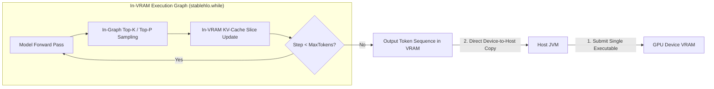

# In-VRAM Autonomous Agent Execution Loop

This document outlines the architectural design and algorithms required to execute **100% In-VRAM Autonomous Agent Loops** in Clojure `clj-xla` using **OpenXLA** and **StableHLO MLIR**.

---

## 1. 🎯 Architectural Goals: Zero-Host Roundtripping

Traditional LLM inference runtimes alternate between GPU forward pass launches and CPU-side token decoding loops:

```
[GPU Forward Pass] ──(Host Transfer)──> [CPU Token Extract & Top-K] ──(Host Transfer)──> [GPU Forward Pass]
```

For long-running software agents (e.g., code generation, agentic reasoning, web navigation), transferring intermediate tokens and KV-cache references back and forth between host JVM memory and GPU device VRAM introduces:
- **PCIe Bus Latency Overhead** (~50–200 $\mu s$ per step).
- **JVM Garbage Collection Pauses** (off-heap buffer churning).
- **Host Thread Synchronization Deadlocks** (`PJRT_Event_Await` contention).

### The In-VRAM Solution: Single-Fused XLA Loop Kernel
By compiling the entire autoregressive decoding loop into a single fused OpenXLA `stablehlo.while` execution graph, the entire token generation sequence executes **100% inside GPU VRAM**:



---

## 2. 🌀 StableHLO Loop State Tuple Construction

In StableHLO MLIR, `stablehlo.while` accepts a single state tuple `(T_0, T_1, ..., T_N)` containing all loop variables:

$$\text{LoopState} = \Big(\text{step}, \text{cur\_token}, \text{tokens\_out}, \text{rng\_state}, K_0, V_0, K_1, V_1, \dots, K_{34}, V_{34}\Big)$$

### StableHLO SSA Graph Representation
In `clj-xla`, the loop state tuple is defined as an immutable SSA vector lowered into a `:stablehlo/while` equation:

```clojure
(defn build-in-vram-agent-loop-graph
  [config max-tokens]
  ;; Cond graph: checks if step < max-tokens
  ;; Body graph: single-token model forward -> sample -> update KV -> step + 1
  {:name "in_vram_agent_loop"
   :invars [[:init_token {:type [:tensor [1] :i32]}]
            [:init_tokens_out {:type [:tensor [max-tokens] :i32]}]]
   :outvars [:final_state]
   :eqns [{:op :stablehlo/while
           :invars [:init_token :init_tokens_out]
           :outvars [:final_state]
           :attrs {:cond-graph cond-graph
                   :body-graph body-graph}}]})
```

---

## 3. 🎲 In-Graph Autoregressive Sampling

To avoid transferring logit vectors back to the CPU for sampling, token selection algorithms are compiled directly into StableHLO MLIR ops:

### Top-K & Temperature Sampling in StableHLO
1. **Temperature Scaling**: `logits_scaled = logits / temperature`.
2. **Top-K Selection**: Apply `stablehlo.sort` along the vocabulary dimension in descending order, slice the top $K$ items, and apply `stablehlo.softmax`.
3. **Categorical Sampling**: Compute cumulative sum (`stablehlo.reduce_window`) and compare against an in-graph pseudo-random uniform variate (`stablehlo.rng_bit_generator`).

---

## 4. ⚡ Zero-Copy Host Memory Buffer Transfers

When initiating generation or reading completed output sequences, host-side Clojure code relies on Panama FFM direct memory transfers:

### Pre-Allocated Device Buffers
```clojure
(defn create-agent-device-session
  [ctx client config]
  (let [;; Allocate KV-caches directly on device VRAM
        device-kv (mapv (fn [_]
                          (clj-xla.pjrt/buffer-from-host-buffer
                           ctx client (float-array (* 1 1 1024 256)) [1 1 1024 256] 11))
                        (range (:num-layers config)))]
    {:ctx ctx
     :client client
     :kv-caches device-kv}))
```

### Async Host Retrieval
Upon loop completion, the host performs a single non-blocking `PJRT_Buffer_To_Host_Buffer` call to copy the generated token ID array directly into a host Clojure vector.
