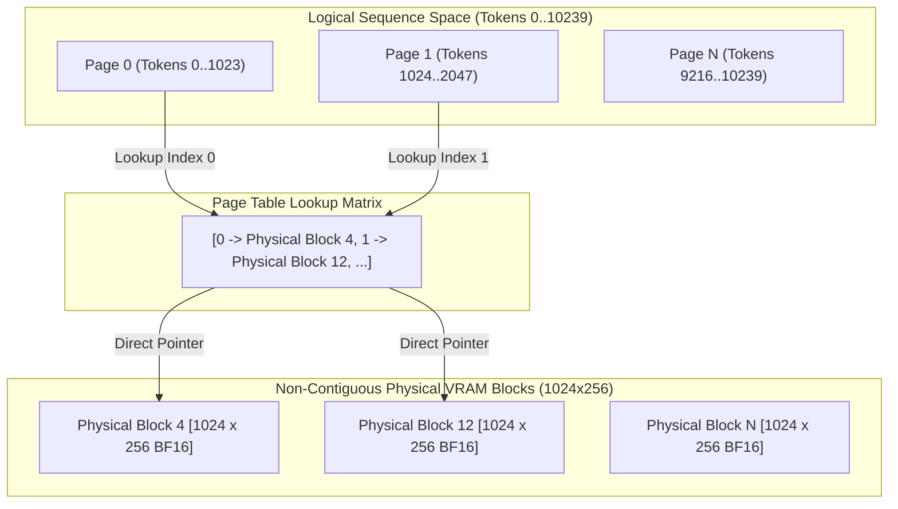

# Paged KV-Cache & Long-Context VRAM Allocation Algorithms

This document describes state-of-the-art (SOTA) memory allocation algorithms and StableHLO graph formulations for scaling LLM context windows up to **256,000 tokens** inside GPU VRAM using OpenXLA.

---

## 1. 📊 VRAM Memory Footprint Mathematics

For long-running agents operating on large code repositories or document contexts, memory footprint is dictated by three components: **Model Weights**, **KV-Cache State**, and **Attention Intermediate Activations**.

### Mathematical Formulations

#### 1. Static Model Weights
$$M_{\text{weights}} = P \times B_{\text{weight}}$$
* $P$: Parameter count ($2.3 \times 10^9$ for Gemma 4 E2B).
* $B_{\text{weight}}$: Bytes per weight ($2$ bytes for `bf16`).
* **Gemma 4 E2B Weight Footprint**: $4.60\text{ GB}$.

#### 2. KV-Cache Memory Allocation
$$M_{\text{kv}}(S) = 2 \times L \times N_{\text{kv}} \times S \times D_{\text{head}} \times B_{\text{kv}}$$
* $L$: Transformer layers ($35$).
* $N_{\text{kv}}$: KV attention heads ($1$ for GQA).
* $S$: Sequence length ($\text{prompt\_len} + \text{max\_new\_tokens}$).
* $D_{\text{head}}$: Dimension per head ($256$).
* $B_{\text{kv}}$: Precision bytes ($2$ bytes for `bf16`, $1$ byte for `int8`/`fp8`).

$$\text{Memory Rate (BF16)} = 2 \times 35 \times 1 \times 1 \times 256 \times 2 = \mathbf{35.84\text{ KB per token}}$$

| Sequence Length ($S$) | BF16 KV-Cache | FP8 / INT8 Quantized KV-Cache | Total Memory (Weights + KV) |
| :--- | :--- | :--- | :--- |
| **10,240 tokens (10K)** | $367\text{ MB}$ | $183.5\text{ MB}$ | $4.96\text{ GB}$ |
| **32,768 tokens (32K)** | $1.17\text{ GB}$ | $587.2\text{ MB}$ | $5.77\text{ GB}$ |
| **131,072 tokens (128K)**| $4.70\text{ GB}$ | $2.35\text{ GB}$ | $9.30\text{ GB}$ |
| **262,144 tokens (256K)**| **$9.39\text{ GB}$** | **$4.70\text{ GB}$** | **$13.99\text{ GB}$ (BF16) / $9.30\text{ GB}$ (FP8)** |

---

## 2. 🧩 PagedAttention Block Tables in StableHLO

To prevent contiguous 32-bit offset limits during `stablehlo.dynamic_update_slice` on sequence lengths $>2048$, KV-caches are divided into fixed 1024-token physical memory blocks (pages).

### Page Table Architecture



### StableHLO Implementation Pattern
Instead of a single tensor `[1, 1, 10240, 256]`, the cache is defined as a block tensor `[num_blocks, 1024, 256]`:

```clojure
(defn update-paged-kv-cache
  [page-blocks block-table token-pos new-k new-v]
  (let [page-size 1024
        block-idx (clj-xla.tensor/quot token-pos page-size)
        offset-in-block (clj-xla.tensor/rem token-pos page-size)
        physical-block-id (clj-xla.tensor/gather block-table [block-idx])]
    ;; Dynamic slice update operates strictly within a 1024-token page
    (clj-xla.tensor/dynamic-update-slice
     page-blocks new-k [physical-block-id offset-in-block 0])))
```

---

## 3. ✂️ Gemma 4 Hybrid Sliding Window Eviction

Gemma 4 architecture pairs global self-attention layers with local sliding-window layers ($W = 512$ or $1024$).

### In-Graph Cache Eviction
For sliding-window layers, historical KV tokens beyond window size $W$ are automatically overwritten using modular indexing:

$$\text{write\_slot} = \text{token\_pos} \pmod W$$

This bounds memory utilization for sliding-window layers to a constant $O(W)$ footprint regardless of context length $S$.

---

## 4. 📦 In-Graph Quantized FP8 / INT8 KV-Cache

To reduce KV-cache VRAM consumption by **50% to 75%**, keys and values are quantized to `fp8_e4m3fn` or `int8` before writing to device VRAM.

### Quantization Equations
$$\text{scale} = \frac{\max(|K|)}{127.0}$$
$$K_{\text{quantized}} = \text{clip}\left(\text{round}\left(\frac{K}{\text{scale}}\right), -128, 127\right)$$

In StableHLO MLIR, de-quantization is fused directly with matrix multiplication (`stablehlo.dot_general`):
$$K_{\text{dequant}} = \text{convert}(K_{\text{quantized}}, \text{f32}) \times \text{scale}$$

This allows fitting a complete 256K token agent context window in less than **10 GB of VRAM**.
